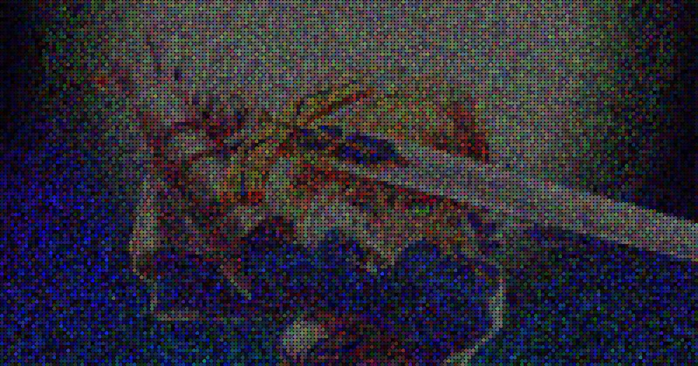
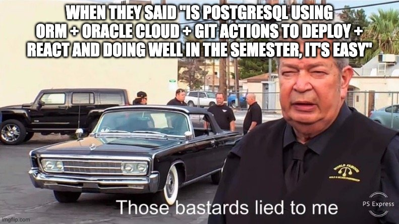
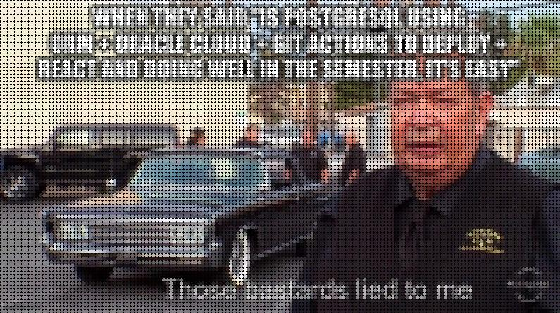

# Image-Art
 IA-Project1 - Image Art, ITCR, 2023

# How to run the program
## 1. Install dependencies
```haskell
pip install -r requirements.txt
```
## 2. Help & Usage
```haskell
usage: main.py [-h] -i INPUT -o OUTPUT [-f {1,2}] [-t] [-d DIMENSION] [-n NUM]
               [-m MUTATION] [-c CROSSOVER] [-v]

Image processing script

options:
  -h, --help            show this help message and exit
  -i INPUT, --input INPUT
                        Input image file path
  -o OUTPUT, --output OUTPUT
                        Output image file name
  -f {1,2}, --fitness {1,2}
                        Fitness function to use
  -t, --time            Print the start time and end time with timestap
  -d DIMENSION, --dimension DIMENSION
                        Grid dimension
  -n NUM, --num NUM     Number of chromosomes
  -m MUTATION, --mutation MUTATION
                        Mutation probability
  -c CROSSOVER, --crossover CROSSOVER
                        Crossover chance
  -v, --verbose         Print the parameters
  ```
## 2. Run the program
Basic usage:
```haskell
python main.py -i <image input> -o <image result>
```
Pro usage:
```haskell
python main.py -i <image input> -o <image result> -f <fitness function> -t -d <grid dimension> -n <number of chromosomes> -m <mutation probability> -c <crossover chance> -v
```
## 3. Examples
### 3.1 Basic usage
```haskell
python main.py -i images/saber2.png -o saber2_result.png
```

<p><center>Figure 1. Original image</center></p>


<p><center>Figure 2. Result image using the 2nd fitness implementation</center></p>

### 3.2 Pro usage
```haskell
python main.py -i test.jpg -o result_test_fitness2.jpg -t -f 2 -n 80 -d 5 -m 0.7 -c 0.4
GRID_DIMENSION: 5
NUM_CHROMOSOMES: 80
MUTATION_PROBABILITY: 0.7
CROSSOVER_CHANCE: 0.4
fitness: fitness2
input: images/test.jpg
output: test_result.jpg
time: True
Start time: Mon Sep 25 14:19:20 2023
End time: Mon Sep 25 14:38:10 2023
Elapsed time: 1129.097506761551 second
```


<p><center>Figure 3. Original meme image</center></p>


<p><center>Figure 4. Result image using the 2nd fitness implementation</center></p>
